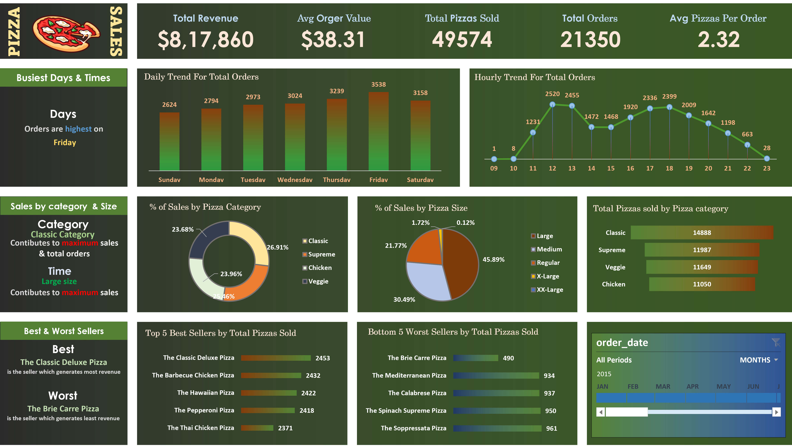

# Pizza Sales Dashboard

## Overview
An interactive Excel dashboard that provides comprehensive analytics and visualizations for pizza sales data. The dashboard offers insights into sales patterns, popular products, and business performance metrics.

## Features
- **Sales Overview**
  - Total Revenue: $817,860
  - Average Order Value: $38.31
  - Total Pizzas Sold: 49,574
  - Total Orders: 21,350
  - Average Pizzas Per Order: 2.32

- **Time-Based Analysis**
  - Daily order trends visualization
  - Hourly sales patterns
  - Peak business hours identification
  - Busiest days highlighted (Friday shows highest sales)

- **Product Performance**
  - Sales breakdown by pizza category
  - Size-wise sales distribution
  - Top 5 best-selling pizzas
  - Bottom 5 performing pizzas

## Key Insights
- **Category Analysis**
  - Classic category leads in sales
  - Four main pizza categories tracked: Classic, Supreme, Chicken, and Veggie
  - Size distribution shows Regular and Large sizes as most popular

- **Best Performers**
  1. The Classic Deluxe Pizza (2,453 units)
  2. The Barbecue Chicken Pizza (2,432 units)
  3. The Hawaiian Pizza (2,422 units)

- **Sales Patterns**
  - Peak hours identified between 12-2 PM and 5-7 PM
  - Friday is the busiest day of the week
  - Large size pizzas contribute to maximum sales

## Technical Details
- Built using Microsoft Excel
- Interactive filters and slicers
- Dynamic charts and graphs
- Data refresh capability

## How to Use
1. Download the Excel file
2. Enable macros if prompted
3. Use the date filter to select specific time periods
4. Interact with slicers to filter data
5. Hover over charts for detailed information

## Prerequisites
- Microsoft Excel 2016 or later
- Enable macros for full functionality

## Installation
1. Clone the repository
2. Open the .xlsx file
3. Enable editing and macros if prompted

## Contributing
Feel free to fork this project and submit pull requests for any enhancements.

## Contact

If you have any questions, feedback, or suggestions, please don't hesitate to reach out:

- **LinkedIn**: [Connect with me on LinkedIn](https://www.linkedin.com/in/iajithks/)

Happy exploring!
